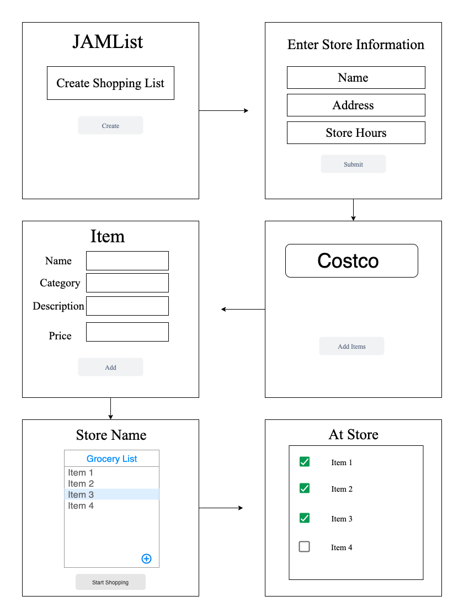
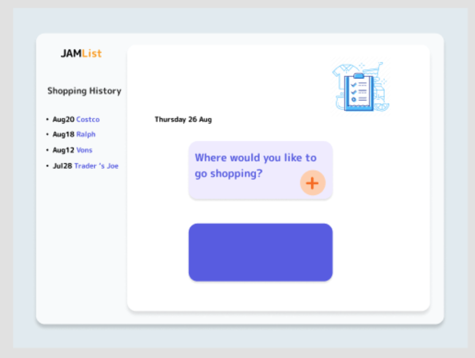
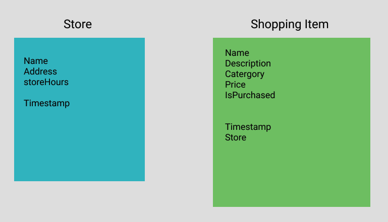

# JAMList
### by Team Jam

## Overview & User Stories
* JAMList is an app to help users create and manage shopping lists by store.
* User begins by adding a store to their favorite store list. They are then prompted to enter Store Name, Store Address, Store Hours, and Total Price to send at the store. They are then redirected to the home screen.
* From the home screen, a user adds items to their grocery list by selecting a category of item to add.
* Once a category is selected, a user is prompted to add additional item information including: Item Name, Description, Price, Organic status, and Store to find it at.
* Once added, the item now appears in the master shopping list on the home page.
* When it's time to go shopping, a user selects which store they will shop at, and a list of items to find at the store populates.


## Technologies Used
* HTML
* CSS
* CSS Frameworks
* JavaScript
* Node.js
* Express.js
* MongoDB
* Mongoose

## Installation
For this project, you will need to install the following dependencies:
* EJS
* Express
* method-override
* Mongoose

### How to install these packages
In your terminal, run:
```
npm init
npm i ejs express method-override mongoose
```

## Link to Page
https://jamlist.herokuapp.com/

## Wireframes
Our first wireframe looked like this, and tells the following user story:
* User begins by creating a shopping list
* Once in the shopping list, the user enters information about where they plan to shop
* They can then select the store that they will shop at, then enters item to be associated with that shopping list.
* From there, a user displays the items to be shopped at that particular location
* They are then able to check off items as they are shopped


It later evolved to these frames:

We worked from this sketch to code the home page, and evolved functionality to tell a clearer user story:


Somewhere between working with two different sets of wireframes, we landed on a simpler user story, as listed above.

## ERD


## Code Snippets
Metha's favorite Code Snippets:
`<text> tbd </text>`
And a brief explanation

Ada's favorite Code Snippets:
`<text> tbd </text>`
And a brief explanation

Jess' favorite Code Snippets:
`<text> tbd </text>`
And a brief explanation


## Unsolved Problems
tbd

## Future Work
* Create ability to host separate users using environmental variables and bcrypt
* Track previously shopped items
* Upload an image of a receipt after a shopping trip, and store it with the shopping instance.
* Incorporate APIs from Apple or Google Maps. When a user sets up a new Store, display it on a map. When a user is at their shopping list, add a button to get directions to the store.

## Acknowledgements
tbd :)

## External API Use
Instacart API
